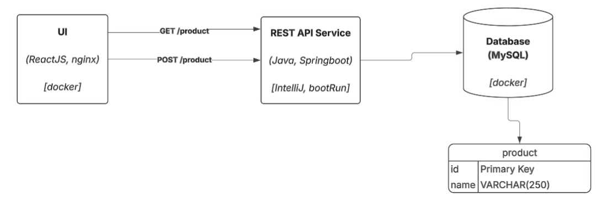

## Architecture Overview

Simplified architecture:



For full architecture, see this design document
- [./Design-Docs/Arch-Design_01_v02.md](./Design-Docs/Arch-Design_01_v02.md)

## Prerequisites

You will need these installed:

- Java 21
- Docker
- IntelliJ - if you want to run backend server in debugger (optional)

NOTE: The following will be run inside docker containers, and therefore do not need separately installed: MySQL, and nginx

## Database Setup

This will start both MySQL and the UI (nginx):

   ```sh
   docker compose up --build
   ```
NOTE: DB initializations & migrations are run each time the Backend server 
starts up (uses Liquibase). See next step.

## Start backend

You can run the Backend server either with Gradle or within IntelliJ debugger.

If running the Backend server with Gradle, then in a second terminal, run this:

   ```sh
   ./gradlew bootRun
   ```

If running the Backend server with IntelliJ debugger, do so now.

NOTE: DB initializations & migrations are run each time the Backend server 
starts up (uses Liquibase). 

## Start frontend

The frontend/nginx server was started above, under "Database Setup".

To access the UI in a web browser, go to:

- http://localhost:3000

## Verify

- In web browser, open http://localhost:3000/
- Add a few products. Verify they show up.
- Refresh the page, verify list is same.
- Add a product with exact name as already existing one. It should allow this.

## Notes

Deviations from preferred stack:

- Database - I used MySQL instead of Postgres because it has been several years since I last used Postgres.

## How I built it

I created a design document (*.md file), then had Codex AI read it and generate the project.

- I created only one file - this design document:

  - [./Design-Docs/Arch-Design_01_v02.md](./Design-Docs/Arch-Design_01_v02.md)

- Then I asked Codex to read the file and let me know if it had any questions. It had a half dozen very good questions.
I answered those questions and had it update the above file to include this new information.
- Then I told Codex to create the code and project files. Codex took about 5-6 minutes.
- I followed the generated README and verified:
  - Everything was running: MySQL DB server, Nginx frontend, and Backend server,  
  - The UI let me list and create new products. I queried the DB directly to very this.
  - I also made sure Backend could run in IntelliJ debugger fine, with breakpoint, etc.


## Run tests

```sh
./gradlew test
```

